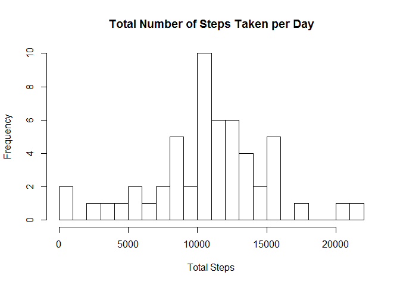
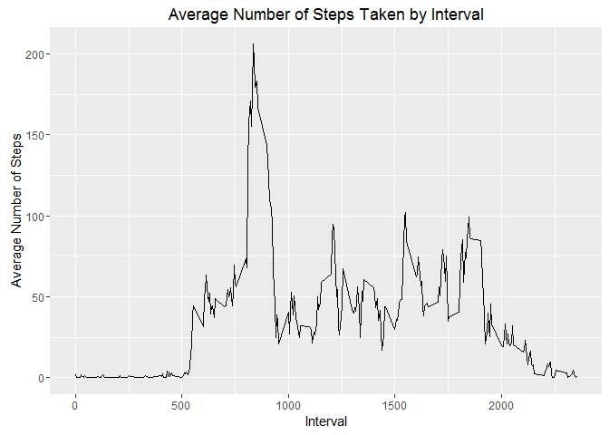
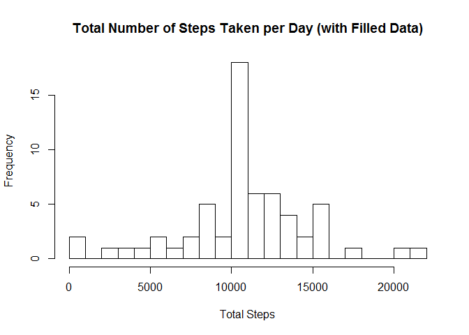
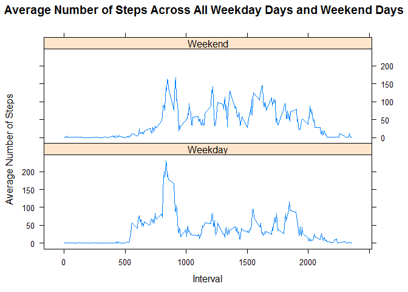

# Reproducible Research: Peer Assessment 1


## Loading and preprocessing the data

```r
unzip("activity.zip")
dat <- read.csv("activity.csv")
dat$date <- as.Date(dat$date, format = "%Y-%m-%d")
library(plyr)
library(dplyr)
library(ggplot2)
```

## What is mean total number of steps taken per day?
1. Calculate the total number of steps taken per day

```r
##Find out total number of steps per day
todat <- aggregate(dat$steps, list(dat$date), sum)
colnames(todat) <- c("Date", "Total_Steps")
as.numeric(todat$Total_Steps)
```

```
##  [1]    NA   126 11352 12116 13294 15420 11015    NA 12811  9900 10304
## [12] 17382 12426 15098 10139 15084 13452 10056 11829 10395  8821 13460
## [23]  8918  8355  2492  6778 10119 11458  5018  9819 15414    NA 10600
## [34] 10571    NA 10439  8334 12883  3219    NA    NA 12608 10765  7336
## [45]    NA    41  5441 14339 15110  8841  4472 12787 20427 21194 14478
## [56] 11834 11162 13646 10183  7047    NA
```

2. Make a histogram of the total number of steps taken each day

```r
##Plot histogram
hist(todat$Total_Steps, breaks = 20, ylab = "Frequency", xlab = "Total Steps", main = "Total Number of Steps Taken per Day")
```



3. Calculate and report the mean and median of the total number of steps taken per day

```r
##Mean total number of steps taken per day
mean(todat$Total_Steps, na.rm = TRUE)
```

```
## [1] 10766.19
```

```r
##Median total number of steps taken per day
median(todat$Total_Steps, na.rm = TRUE)
```

```
## [1] 10765
```

## What is the average daily activity pattern?
1. Make a time series plot (i.e. type = "l") of the 5-minute interval (x-axis) and the average number of steps taken, averaged across all days (y-axis)

```r
newdat <- na.omit(dat)
intdat <- ddply(newdat, .(interval), summarise, ave = mean(steps))

##Create a time series plot
ggplot(intdat, aes(interval, ave)) + geom_line() + labs(title = "Average Number of Steps Taken by Interval") + labs(x = "Interval") + labs(y = "Average Number of Steps")
```



2. Which 5-minute interval, on average across all the days in the dataset, contains the maximum number of steps?

```r
##5-minute interval that contains the maximum number of steps
intdat[intdat$ave == max(intdat$ave),]
```

```
##     interval      ave
## 104      835 206.1698
```

## Imputing missing values
1. Calculate and report the total number of missing values in the dataset (i.e. the total number of rows with NAs)

```r
##Total number of rows with NAs
sum(is.na(dat))
```

```
## [1] 2304
```

2. Devise a strategy for filling in all of the missing values in the dataset

The strategy I devised is to use the mean for the 5-min interval to fill in the missing values.

3. Create a new dataset that is equal to the original dataset but with the missing data filled in

```r
##Use mean of 5-minute interval to fill missing data
datrow <- nrow(dat)
filldat <- dat
for (i in 1:datrow) {
  if (is.na(filldat$steps[i])) {
    filldat$steps[i] <- intdat[which(filldat$interval[i] == intdat$interval),]$ave
  }
}

sum(is.na(filldat))
```

```
## [1] 0
```

4. Make a histogram of the total number of steps taken each day and Calculate and report the mean and median total number of steps taken per day. 

```r
##Plot new histogram
newtodat <- aggregate(filldat$steps, list(filldat$date), sum)
colnames(newtodat) <- c("Date", "Total_Steps")
as.numeric(newtodat$Total_Steps)
```

```
##  [1] 10766.19   126.00 11352.00 12116.00 13294.00 15420.00 11015.00
##  [8] 10766.19 12811.00  9900.00 10304.00 17382.00 12426.00 15098.00
## [15] 10139.00 15084.00 13452.00 10056.00 11829.00 10395.00  8821.00
## [22] 13460.00  8918.00  8355.00  2492.00  6778.00 10119.00 11458.00
## [29]  5018.00  9819.00 15414.00 10766.19 10600.00 10571.00 10766.19
## [36] 10439.00  8334.00 12883.00  3219.00 10766.19 10766.19 12608.00
## [43] 10765.00  7336.00 10766.19    41.00  5441.00 14339.00 15110.00
## [50]  8841.00  4472.00 12787.00 20427.00 21194.00 14478.00 11834.00
## [57] 11162.00 13646.00 10183.00  7047.00 10766.19
```

```r
hist(newtodat$Total_Steps, breaks = 20, ylab = "Frequency", xlab = "Total Steps", main = "Total Number of Steps Taken per Day (with Filled Data)")
```



- Do these values differ from the estimates from the first part of the assignment? What is the impact of imputing missing data on the estimates of the total daily number of steps?

```r
##Mean total number of steps taken per day
mean(newtodat$Total_Steps)
```

```
## [1] 10766.19
```

```r
##Median total number of steps taken per day
median(newtodat$Total_Steps)
```

```
## [1] 10766.19
```
There is no difference in the mean but there is a difference of 1.19 in the median. 

## Are there differences in activity patterns between weekdays and weekends?
1. Create a new factor variable in the dataset with two levels - "weekday" and "weekend" indicating whether a given date is a weekday or weekend day

```r
##Create a new factor variable with two levels - "weekday" and "weekend"
filldat$day <- weekdays(filldat$date)
filldat$day <- as.factor(ifelse(filldat$day == "Saturday" | filldat$day == "Sunday", "Weekend", "Weekday"))
```

2. Make a panel plot containing a time series plot (i.e. type = "l") of the 5-minute interval (x-axis) and the average number of steps taken, averaged across all weekday days or weekend days (y-axis)

```r
##Create a panel plot
library(lattice)
avedat <- aggregate(filldat$steps, list(filldat$interval,filldat$day), mean)
colnames(avedat) <- c("Interval", "Day", "Average_Steps")
xyplot(avedat$Average_Steps ~ avedat$Interval | avedat$Day, type = "l", layout = c(1,2), main = "Average Number of Steps Across All Weekday Days and Weekend Days", ylab = "Average Number of Steps", xlab = "Interval")
```


